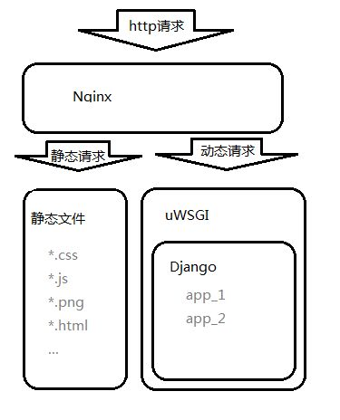
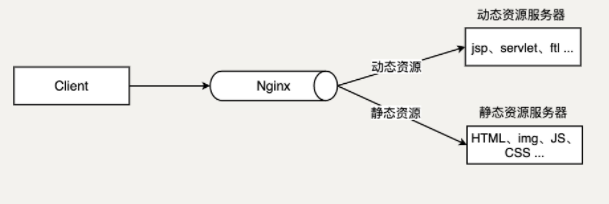
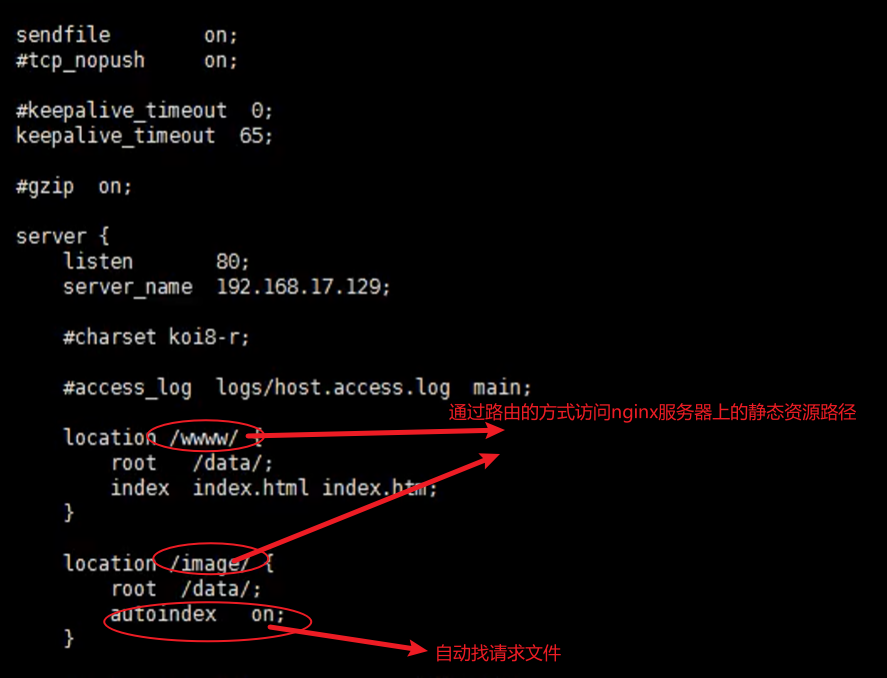

# nginx配置

Nginx是一款轻量级的Web服务器/反向代理服务器及电子邮件（IMAP/POP3）代理服务器，在BSD-like 协议下发行。其特点是占有内存少，并发能力强，事实上Nginx的并发能力在同类型的网页服务器中表现较好。

https://nginx.org/en/

## docker-nginx方法（win32环境）

```dockerfile
docker pull nginx
拉去下来的镜像为debian版
```

```console
避免资源消耗，推荐用法如下:
docker run -itd --name some-nginx -p 8080:80 -v C:/Users/78563/Desktop/templates/:/usr/share/nginx/html nginx
```

```
至于更复杂的分布式nginx部署方法，
可以需要给每个nginx配置nginx.conf，
开放更多端口。

此方法：会在负载均衡篇章讲述
```

### **镜像配置方法，大型项目需要制作imags**

```
可以使用Dockerfile文件，制作专属images

关于Dockerfile的参数配置，以及docker build的用法，需要参考官方网站：

https://docs.docker.com/engine/reference/builder/

docker build -f /user/dockerfile
```

### **配置文件copy到桌面，进行参数配置**

```
docker 
cp some-nginx:/etc/nginx/nginx.conf ./Desktop/nginx.conf
```

```
user  nginx;
worker_processes  auto;

error_log  /var/log/nginx/error.log notice;
pid        /var/run/nginx.pid;


events {
    worker_connections  1024;
}


http {
    include       /etc/nginx/mime.types;
    default_type  application/octet-stream;

    log_format  main  '$remote_addr - $remote_user   [$time_local] "$request" '
                      '$status $body_bytes_sent "$http_referer" '
                      '"$http_user_agent" "$http_x_forwarded_for"';

    access_log  /var/log/nginx/access.log  main;

    sendfile        on;
    #tcp_nopush     on;

    keepalive_timeout  65;

    #gzip  on;

    include /etc/nginx/conf.d/*.conf;
}

```

nginx.conf有三部分：

1.全局块：全局配置，影响nginx服务器整体运行的配置指令。

```
# 定义Nginx运行的用户和用户组
user www www;

# nginx进程数，建议设置为等于CPU总核心数。
worker_processes 8;
 
# 全局错误日志定义类型，[ debug | info | notice | warn | error | crit ]
error_log /usr/local/nginx/logs/error.log info;

# 进程pid文件
pid /usr/local/nginx/logs/nginx.pid;

#指定进程可以打开的最大描述符：数目
#工作模式与连接数上限
#这个指令是指当一个nginx进程打开的最多文件描述符数目，理论值应该是最多打开文件数（ulimit -n）与nginx进程数相除，但是nginx分配请求并不是那么均匀，所以最好与ulimit -n 的值保持一致。
#现在在linux 2.6内核下开启文件打开数为65535，worker_rlimit_nofile就相应应该填写65535。
#这是因为nginx调度时分配请求到进程并不是那么的均衡，所以假如填写10240，总并发量达到3-4万时就有进程可能超过10240了，这时会返回502错误。
worker_rlimit_nofile 65535;
```

2.events块：事件处理，影响nginx与用户网络连接。

```
events
{
    #参考事件模型，use [ kqueue | rtsig | epoll | /dev/poll | select | poll ]; epoll模型
    #是Linux 2.6以上版本内核中的高性能网络I/O模型，linux建议epoll，如果跑在FreeBSD上面，就用kqueue模型。
    #补充说明：
    #与apache相类，nginx针对不同的操作系统，有不同的事件模型
    #A）标准事件模型
    #Select、poll属于标准事件模型，如果当前系统不存在更有效的方法，nginx会选择select或poll
    #B）高效事件模型
    #Kqueue：使用于FreeBSD 4.1+, OpenBSD 2.9+, NetBSD 2.0 和 MacOS X.使用双处理器的MacOS X系统使用kqueue可能会造成内核崩溃。
    #Epoll：使用于Linux内核2.6版本及以后的系统。
    #/dev/poll：使用于Solaris 7 11/99+，HP/UX 11.22+ (eventport)，IRIX 6.5.15+ 和 Tru64 UNIX 5.1A+。
    #Eventport：使用于Solaris 10。 为了防止出现内核崩溃的问题， 有必要安装安全补丁。
    use epoll;

    # 单个进程最大连接数（最大连接数=连接数*进程数）
    # 根据硬件调整，和前面工作进程配合起来用，尽量大，但是别把cpu跑到100%就行。每个进程允许的最多连接数，理论上每台nginx服务器的最大连接数为。
    worker_connections 65535;

    #keepalive超时时间。
    keepalive_timeout 60;

    #客户端请求头部的缓冲区大小。这个可以根据你的系统分页大小来设置，一般一个请求头的大小不会超过1k，不过由于一般系统分页都要大于1k，所以这里设置为分页大小。
    #分页大小可以用命令getconf PAGESIZE 取得。
    #[root@web001 ~]# getconf PAGESIZE
    #4096
    #但也有client_header_buffer_size超过4k的情况，但是client_header_buffer_size该值必须设置为“系统分页大小”的整倍数。
    client_header_buffer_size 4k;

    #这个将为打开文件指定缓存，默认是没有启用的，max指定缓存数量，建议和打开文件数一致，inactive是指经过多长时间文件没被请求后删除缓存。
    open_file_cache max=65535 inactive=60s;

    #这个是指多长时间检查一次缓存的有效信息。
    #语法:open_file_cache_valid time 默认值:open_file_cache_valid 60 使用字段:http, server, location 这个指令指定了何时需要检查open_file_cache中缓存项目的有效信息.
    open_file_cache_valid 80s;

    #open_file_cache指令中的inactive参数时间内文件的最少使用次数，如果超过这个数字，文件描述符一直是在缓存中打开的，如上例，如果有一个文件在inactive时间内一次没被使用，它将被移除。
    #语法:open_file_cache_min_uses number 默认值:open_file_cache_min_uses 1 使用字段:http, server, location  这个指令指定了在open_file_cache指令无效的参数中一定的时间范围内可以使用的最小文件数,如果使用更大的值,文件描述符在cache中总是打开状态.
    open_file_cache_min_uses 1;
    
    #语法:open_file_cache_errors on | off 默认值:open_file_cache_errors off 使用字段:http, server, location 这个指令指定是否在搜索一个文件时记录cache错误.
    open_file_cache_errors on;
}
```

3.http块：最核心的部分，

```
# 设定http服务器，利用它的反向代理功能提供负载均衡支持
http
{
    #文件扩展名与文件类型映射表
    include mime.types;

    #默认文件类型
    default_type application/octet-stream;

    #默认编码
    #charset utf-8;

    #服务器名字的hash表大小
    #保存服务器名字的hash表是由指令server_names_hash_max_size 和server_names_hash_bucket_size所控制的。参数hash bucket size总是等于hash表的大小，并且是一路处理器缓存大小的倍数。在减少了在内存中的存取次数后，使在处理器中加速查找hash表键值成为可能。如果hash bucket size等于一路处理器缓存的大小，那么在查找键的时候，最坏的情况下在内存中查找的次数为2。第一次是确定存储单元的地址，第二次是在存储单元中查找键 值。因此，如果Nginx给出需要增大hash max size 或 hash bucket size的提示，那么首要的是增大前一个参数的大小.
    server_names_hash_bucket_size 128;

    #客户端请求头部的缓冲区大小。这个可以根据你的系统分页大小来设置，一般一个请求的头部大小不会超过1k，不过由于一般系统分页都要大于1k，所以这里设置为分页大小。分页大小可以用命令getconf PAGESIZE取得。
    client_header_buffer_size 32k;

    #客户请求头缓冲大小。nginx默认会用client_header_buffer_size这个buffer来读取header值，如果header过大，它会使用large_client_header_buffers来读取。
    large_client_header_buffers 4 64k;

    #设定通过nginx上传文件的大小
    client_max_body_size 8m;

    #开启高效文件传输模式，sendfile指令指定nginx是否调用sendfile函数来输出文件，对于普通应用设为 on，如果用来进行下载等应用磁盘IO重负载应用，可设置为off，以平衡磁盘与网络I/O处理速度，降低系统的负载。注意：如果图片显示不正常把这个改成off。
    #sendfile指令指定 nginx 是否调用sendfile 函数（zero copy 方式）来输出文件，对于普通应用，必须设为on。如果用来进行下载等应用磁盘IO重负载应用，可设置为off，以平衡磁盘与网络IO处理速度，降低系统uptime。
    sendfile on;

    #开启目录列表访问，合适下载服务器，默认关闭。
    autoindex on;

    #此选项允许或禁止使用socke的TCP_CORK的选项，此选项仅在使用sendfile的时候使用
    tcp_nopush on;
     
    tcp_nodelay on;

    #长连接超时时间，单位是秒
    keepalive_timeout 120;

    #FastCGI相关参数是为了改善网站的性能：减少资源占用，提高访问速度。下面参数看字面意思都能理解。
    fastcgi_connect_timeout 300;
    fastcgi_send_timeout 300;
    fastcgi_read_timeout 300;
    fastcgi_buffer_size 64k;
    fastcgi_buffers 4 64k;
    fastcgi_busy_buffers_size 128k;
    fastcgi_temp_file_write_size 128k;

    #gzip模块设置
    gzip on; #开启gzip压缩输出
    gzip_min_length 1k;    #最小压缩文件大小
    gzip_buffers 4 16k;    #压缩缓冲区
    gzip_http_version 1.0;    #压缩版本（默认1.1，前端如果是squid2.5请使用1.0）
    gzip_comp_level 2;    #压缩等级
    gzip_types text/plain application/x-javascript text/css application/xml;    #压缩类型，默认就已经包含textml，所以下面就不用再写了，写上去也不会有问题，但是会有一个warn。
    gzip_vary on;

    #开启限制IP连接数的时候需要使用
    #limit_zone crawler $binary_remote_addr 10m;


    #负载均衡配置
    upstream jh.w3cschool.cn {
     
        #upstream的负载均衡，weight是权重，可以根据机器配置定义权重。weigth参数表示权值，权值越高被分配到的几率越大。
        server 192.168.80.121:80 weight=3;
        server 192.168.80.122:80 weight=2;
        server 192.168.80.123:80 weight=3;

        #nginx的upstream目前支持4种方式的分配
        #1、轮询（默认）
        #每个请求按时间顺序逐一分配到不同的后端服务器，如果后端服务器down掉，能自动剔除。
        #2、weight
        #指定轮询几率，weight和访问比率成正比，用于后端服务器性能不均的情况。
        #例如：
        #upstream bakend {
        #    server 192.168.0.14 weight=10;
        #    server 192.168.0.15 weight=10;
        #}
        #2、ip_hash
        #每个请求按访问ip的hash结果分配，这样每个访客固定访问一个后端服务器，可以解决session的问题。
        #例如：
        #upstream bakend {
        #    ip_hash;
        #    server 192.168.0.14:88;
        #    server 192.168.0.15:80;
        #}
        #3、fair（第三方）
        #按后端服务器的响应时间来分配请求，响应时间短的优先分配。
        #upstream backend {
        #    server server1;
        #    server server2;
        #    fair;
        #}
        #4、url_hash（第三方）
        #按访问url的hash结果来分配请求，使每个url定向到同一个后端服务器，后端服务器为缓存时比较有效。
        #例：在upstream中加入hash语句，server语句中不能写入weight等其他的参数，hash_method是使用的hash算法
        #upstream backend {
        #    server squid1:3128;
        #    server squid2:3128;
        #    hash $request_uri;
        #    hash_method crc32;
        #}

        #tips:
        #upstream bakend{#定义负载均衡设备的Ip及设备状态}{
        #    ip_hash;
        #    server 127.0.0.1:9090 down;
        #    server 127.0.0.1:8080 weight=2;
        #    server 127.0.0.1:6060;
        #    server 127.0.0.1:7070 backup;
        #}
        #在需要使用负载均衡的server中增加 proxy_pass http://bakend/;

        #每个设备的状态设置为:
        #1.down表示单前的server暂时不参与负载
        #2.weight为weight越大，负载的权重就越大。
        #3.max_fails：允许请求失败的次数默认为1.当超过最大次数时，返回proxy_next_upstream模块定义的错误
        #4.fail_timeout:max_fails次失败后，暂停的时间。
        #5.backup： 其它所有的非backup机器down或者忙的时候，请求backup机器。所以这台机器压力会最轻。

        #nginx支持同时设置多组的负载均衡，用来给不用的server来使用。
        #client_body_in_file_only设置为On 可以讲client post过来的数据记录到文件中用来做debug
        #client_body_temp_path设置记录文件的目录 可以设置最多3层目录
        #location对URL进行匹配.可以进行重定向或者进行新的代理 负载均衡
    }
    # 这里把server模块放在下面了
}
```

http中server块:

```
    # 虚拟主机的配置
    server
    {
        # 监听端口
        listen 80;

        # 域名可以有多个，用空格隔开
        server_name www.w3cschool.cn w3cschool.cn;
        index index.html index.htm index.php;
        root /data/www/w3cschool;

        #对******进行负载均衡
        location ~ .*.(php|php5)?$
        {
            fastcgi_pass 127.0.0.1:9000;
            fastcgi_index index.php;
            include fastcgi.conf;
        }
         
        #图片缓存时间设置
        location ~ .*.(gif|jpg|jpeg|png|bmp|swf)$
        {
            expires 10d;
        }
         
        #JS和CSS缓存时间设置
        location ~ .*.(js|css)?$
        {
            expires 1h;
        }
         
        #日志格式设定
        #$remote_addr与$http_x_forwarded_for用以记录客户端的ip地址；
        #$remote_user：用来记录客户端用户名称；
        #$time_local： 用来记录访问时间与时区；
        #$request： 用来记录请求的url与http协议；
        #$status： 用来记录请求状态；成功是200，
        #$body_bytes_sent ：记录发送给客户端文件主体内容大小；
        #$http_referer：用来记录从那个页面链接访问过来的；
        #$http_user_agent：记录客户浏览器的相关信息；
        #通常web服务器放在反向代理的后面，这样就不能获取到客户的IP地址了，通过$remote_add拿到的IP地址是反向代理服务器的iP地址。反向代理服务器在转发请求的http头信息中，可以增加x_forwarded_for信息，用以记录原有客户端的IP地址和原来客户端的请求的服务器地址。
        log_format access '$remote_addr - $remote_user [$time_local] "$request" '
        '$status $body_bytes_sent "$http_referer" '
        '"$http_user_agent" $http_x_forwarded_for';
         
        #定义本虚拟主机的访问日志
        access_log  /usr/local/nginx/logs/host.access.log  main;
        access_log  /usr/local/nginx/logs/host.access.404.log  log404;
        
        ##这里是server中三个的location地址##
}
```

location模块，可以在server中配置多个，主要是对特定request进行处理，地址定向，数据缓存，应答控制，很多三方模块也在这里配置。


```
关键字主导的上下文管理器

location /img/ {
alias /var/www/image/;
}
上述表示：访问/img/的url中你的文件，则nginx会去/var/www/image/中找文件。
location /img/ {
    root /var/www/image;
}

上述表示：访问/img/的url中你的文件，nginx会把/var/www/image当上层目录，去下层找/var/www/image/img/文件。
  location / {
        root /var/www/;
        index index.htm index.html;
        }
上述表示：当路由到“/”时，nginx会到root所指导的目录下，寻找/var/www/index.html和/var/www/index.htm文件
index：其实就是准确文件的索引


特殊用法:
location / {
    try_files /system/maintenance.html
              $uri $uri/index.html $uri.html
              @mongrel;
}

location @mongrel {
    proxy_pass http://mongrel;
}
proxy_pass: 转发给那个端口（一般是后端api）


关键点1：按指定的file顺序查找存在的文件，并使用第一个找到的文件进行请求处理

关键点2：查找路径是按照给定的root或alias为根路径来查找的
关键点3：如果给出的file都没有匹配到，则重新请求最后一个参数给定的uri，就是新的location匹配
关键点4：如果是格式2，如果最后一个参数是 = 404 ，若给出的file都没有匹配到，则最后返回404的响应码

 3.举例说明：
location /images/ {
    root /opt/html/;
    try_files $uri   $uri/  /images/default.gif; 
}
比如 请求 127.0.0.1/images/test.gif 会依次查找
1.文件/opt/html/images/test.gif   
2.文件夹 /opt/html/images/test.gif/下的index文件  
3. 请求127.0.0.1/images/default.gif

4.其他注意事项
1.try-files 如果不写上 $uri/，当直接访问一个目录路径时，并不会去匹配目录下的索引页  即 访问127.0.0.1/images/ 不会去访问  127.0.0.1/images/index.html 

fastcgi_pass是什么?
这个是GI网关的一种！这里是个插件，很多python web开发框架都有GI配置

```

```
# 对 "/" 启用反向代理,server中的location模块
        location / {
            proxy_pass http://127.0.0.1:88;
            proxy_redirect off;
            proxy_set_header X-Real-IP $remote_addr;
             
            #后端的Web服务器可以通过X-Forwarded-For获取用户真实IP
            proxy_set_header X-Forwarded-For $proxy_add_x_forwarded_for;
             
            #以下是一些反向代理的配置，可选。
            proxy_set_header Host $host;

            #允许客户端请求的最大单文件字节数
            client_max_body_size 10m;

            #缓冲区代理缓冲用户端请求的最大字节数，
            #如果把它设置为比较大的数值，例如256k，那么，无论使用firefox还是IE浏览器，来提交任意小于256k的图片，都很正常。如果注释该指令，使用默认的client_body_buffer_size设置，也就是操作系统页面大小的两倍，8k或者16k，问题就出现了。
            #无论使用firefox4.0还是IE8.0，提交一个比较大，200k左右的图片，都返回500 Internal Server Error错误
            client_body_buffer_size 128k;

            #表示使nginx阻止HTTP应答代码为400或者更高的应答。
            proxy_intercept_errors on;

            #后端服务器连接的超时时间_发起握手等候响应超时时间
            #nginx跟后端服务器连接超时时间(代理连接超时)
            proxy_connect_timeout 90;

            #后端服务器数据回传时间(代理发送超时)
            #后端服务器数据回传时间_就是在规定时间之内后端服务器必须传完所有的数据
            proxy_send_timeout 90;

            #连接成功后，后端服务器响应时间(代理接收超时)
            #连接成功后_等候后端服务器响应时间_其实已经进入后端的排队之中等候处理（也可以说是后端服务器处理请求的时间）
            proxy_read_timeout 90;

            #设置代理服务器（nginx）保存用户头信息的缓冲区大小
            #设置从被代理服务器读取的第一部分应答的缓冲区大小，通常情况下这部分应答中包含一个小的应答头，默认情况下这个值的大小为指令proxy_buffers中指定的一个缓冲区的大小，不过可以将其设置为更小
            proxy_buffer_size 4k;

            #proxy_buffers缓冲区，网页平均在32k以下的设置
            #设置用于读取应答（来自被代理服务器）的缓冲区数目和大小，默认情况也为分页大小，根据操作系统的不同可能是4k或者8k
            proxy_buffers 4 32k;

            #高负荷下缓冲大小（proxy_buffers*2）
            proxy_busy_buffers_size 64k;

            #设置在写入proxy_temp_path时数据的大小，预防一个工作进程在传递文件时阻塞太长
            #设定缓存文件夹大小，大于这个值，将从upstream服务器传
            proxy_temp_file_write_size 64k;
        }
         
         
        # 设定查看Nginx状态的地址，这里就是第二个地址
        location /NginxStatus {
            stub_status on;
            access_log on;
            auth_basic "NginxStatus";
            auth_basic_user_file confpasswd;
            #htpasswd文件的内容可以用apache提供的htpasswd工具来产生。
        }
         
        #本地动静分离反向代理配置
        #所有jsp的页面均交由tomcat或resin处理
        location ~ .(jsp|jspx|do)?$ {
            proxy_set_header Host $host;
            proxy_set_header X-Real-IP $remote_addr;
            proxy_set_header X-Forwarded-For $proxy_add_x_forwarded_for;
            proxy_pass http://127.0.0.1:8080;
        }
         
        #所有静态文件由nginx直接读取不经过tomcat或resin
        location ~ .*.(htm|html|gif|jpg|jpeg|png|bmp|swf|ioc|rar|zip|txt|flv|mid|doc|ppt|
        pdf|xls|mp3|wma)$
        {
            expires 15d; 
        }
         
        location ~ .*.(js|css)?$
        {
            expires 1h;
        }
```


端口映射，外界访问8080，容器内则是80

```
docker run -itd --name some-nginx -p 8080:80 nginx
```


```
docker exec -it some-nginx /bin/bash
```



#### 反向代理


正向代理：（**翻墙**）可以用作正向代理，实现跨域访问。如果把局域网外的net当成一个巨大的资源库，则局域网中的客户端想要访问net，则需要代理服务器去访问。**客户端需要配置代理服务器**


反向代理：客户端对代理是无感知的，客户端不需要做任何配置。将request发送到反向代理服务器中（指：装有反向代理服务软件的服务器），由反向代理服务器去选择目标服务器（内网服务器），经过网关（一般是uwsgi，路由），进行data交换。

反向代理服务器在公网暴漏ip，而内网服务器ip被隐藏。

#### 负载均衡

早期网关承担的流程，性能低下。


加入反向代理，做服务器集群，开启负载均衡，提高性能。


理论上每个web服务器，接收到的request数量是一致的，其实是不一定的，类似rabbitmq消息中间件。

#### 动静分离



## linux-install方法（ubuntu）

如果是cloud server部署，需要设置阿里网关+服务器firewall。

1.在Linux中安装nginx

```
1.源安装
apt-get install nginx
2.下载解压安装 
wget https://nginx.org/download/nginx-1.21.6.tar.gz
```

2.常用命令

```
service nginx start
service nginx restart
service nginx stop
service nginx status

# nginx命令存放处(文件即系统！！！)
/usr/sbin/nginx

# 配置文件存放位置
/etc/nginx/nginx.conf

./usr/sbin/nginx # 启动nginx

nginx -s reopen #重启Nginx

nginx -s reload #重新加载Nginx配置文件，然后以优雅的方式重启Nginx

nginx -s stop #强制停止Nginx服务

killall nginx #杀死所有nginx进程  

nginx -s quit #优雅地停止Nginx服务（即处理完所有请求后再停止服务）

nginx -t #检测配置文件是否有语法错误，然后退出

nginx -v #显示版本信息并退出

nginx -V #显示版本和配置选项信息，然后退出

nginx -t #检测配置文件是否有语法错误，然后退出

nginx -T #检测配置文件是否有语法错误，转储并退出

nginx -q #在检测配置文件期间屏蔽非错误信息

nginx -?,-h #打开帮助信息  

nginx -p prefix #设置前缀路径(默认是:/usr/share/nginx/)

nginx -c filename #设置配置文件(默认是:/etc/nginx/nginx.conf)

nginx -g directives #设置配置文件外的全局指令
```

## 例子：

#### 反向代理例子

c:\windows\system32\drivers\etc\hosts


这样一来静态文件即可被代理，存在两个webu服务器时，则以路由划分端口。


**可以通过re路由划分，区分不同的web服务**


#### **负载均衡例子**

http中加入


在http.server.location中加入


##### 对服务器分配负载的策略

1.轮询分配：按照时间顺序分配request

2.weight权重分配


3.ip_hash：每个请求按照访问ip的hash结果进行分配，这样每个访客可以固定访问一个web服务器，解决session问题。


★实际上可以通过数据库集群解决！所有web服务器都可以通过访问一张session表满足session一致性。

4.fair方式：以respone的响应时间分配web服务器

分布式数据中心需要这种方式


#### **动静分离例子**

动态请求：数据库，计算，执行task等

静态请求：html+css+images+video等等

js代码则是特殊文件，ajax是动态，操控CSS则是静态


js代码监测客户端


利用缓存可以减少后端压力。在location中添加字段可以实现缓存。

expires 1d;




★更主流的方式：

单独设置一台静态资源服务器，加入nginx代理，将其专门作为一个静态资源服务器即可。（在内网设置一个ip，然后带）


#### **nginx配置高可用集群（多反向代理服务器）**

keepalived 虚拟化ip软件，这是一个多用途Rose


这里就是容器化的好处了，随时可以集群化部署。

https://keepalived.readthedocs.io/en/latest/configuration_synopsis.html

```
apt-get install curl gcc libssl-dev libnl-3-dev libnl-genl-3-dev libsnmp-dev
```

```
apt-get install keepalived
```

keepalived的配置文件

```
/etc/keepalived/keepalived.conf
```

```

! Configuration File for keepalived
 
global_defs {					#全局配置
	notification_email {		#指定keepalived在发生切换时需要发送email到的对象，一行一个
		acassen@firewall.loc	#指定收件人邮箱
		failover@firewall.loc
		sysadmin@firewall.loc
	}
	notification_email_from Alexandre.Cassen@firewall.loc #指定发件人
	smtp_server 192.168.200.1	#指定smtp服务器地址
	smtp_connect_timeout 30		#指定smtp连接超时时间
	router_id LVS_DEVEL			#此处注意router_id为负载均衡标识，在局域网内应该是唯一的。
	vrrp_skip_check_adv_addr
	vrrp_strict
	vrrp_garp_interval 0
	vrrp_gna_interval 0
}
 
vrrp_sync_group VG_1{				#监控多个网段的实例
	group {
		inside_network				#实例名
		outside_network
	}
	notify_master /path/xx.sh		#指定当切换到master时，执行的脚本
	netify_backup /path/xx.sh		#指定当切换到backup时，执行的脚本
	notify_fault "path/xx.sh VG_1" 	#故障时执行的脚本
	notify /path/xx.sh
	smtp_alert 						#使用global_defs中提供的邮件地址和smtp服务器发送邮件通知
}
 
vrrp_instance inside_network {
	state BACKUP 			#指定那个为master，那个为backup，如果设置了nopreempt这个值不起作用，主备考priority决定
	interface eth0 			#设置实例绑定的网卡
	dont_track_primary 		#忽略vrrp的interface错误（默认不设置）
	track_interface{ 		#设置额外的监控，里面那个网卡出现问题都会切换
		eth0
		eth1
	}
	mcast_src_ip			#发送多播包的地址，如果不设置默认使用绑定网卡的primary ip
	garp_master_delay		#在切换到master状态后，延迟进行gratuitous ARP请求
	virtual_router_id 50	#VPID标记
	priority 99				#优先级，高优先级竞选为master
	advert_int 1			#检查间隔，默认1秒
	nopreempt				#设置为不抢占 注：这个配置只能设置在backup主机上，而且这个主机优先级要比另外一台高
	preempt_delay			#抢占延时，默认5分钟
	debug					#debug级别
	authentication {		#设置认证
		auth_type PASS		#认证方式，类型主要有PASS、AH 两种
		auth_pass 111111	#认证密码
	}
	virtual_ipaddress {		#设置vip
		192.168.36.200
	}
}
 
vrrp_instance VI_1 {		#虚拟路由的标识符
	state MASTER			#状态只有MASTER和BACKUP两种，并且要大写，MASTER为工作状态，BACKUP是备用状态
	interface eth0			#通信所使用的网络接口
    lvs_sync_daemon_inteface eth0  #这个默认没有，相当于心跳线接口，DR模式用的和上面的接口一样，也可以用机器上的其他网卡eth1，用来防止脑裂。
    virtual_router_id 51	#虚拟路由的ID号，是虚拟路由MAC的最后一位地址
    priority 100			#此节点的优先级，主节点的优先级需要比其他节点高
    advert_int 1			#通告的间隔时间
    nopreempt				#设置为不抢占 注：这个配置只能设置在backup主机上，而且这个主机优先级要比另外一台高
    preempt_delay			#抢占延时，默认5分钟
    authentication {		#认证配置
		auth_type PASS		#认证方式
        auth_pass 1111		#认证密码
    }
    virtual_ipaddress {		#虚拟ip地址,可以有多个地址，每个地址占一行，不需要子网掩码，同时这个ip 必须与我们在lvs 客户端设定的vip 相一致！
        192.168.200.16
        192.168.200.17
        192.168.200.18
    }
}
 
virtual_server 192.168.200.100 443 { #集群所使用的VIP和端口
    delay_loop 6					#健康检查间隔，单位为秒
    lb_algo rr						#lvs调度算法rr|wrr|lc|wlc|lblc|sh|dh
    nat_mask 255.255.255.0			#VIP掩码
    lb_kind NAT						#负载均衡转发规则。一般包括DR,NAT,TUN 3种
    persistence_timeout 50			#会话保持时间，会话保持，就是把用户请求转发给同一个服务器，不然刚在1上提交完帐号密码，就跳转到另一台服务器2上了
    protocol TCP					#转发协议，有TCP和UDP两种，一般用TCP，没用过UDP
    persistence_granularity <NETMASK> #lvs会话保持粒度
 
    real_server 192.168.201.100 443 { #真实服务器，包括IP和端口号
        weight 1					#默认为1,0为失效
        inhibit_on_failure			#在服务器健康检查失效时，将其设为0，而不是直接从ipvs中删除
        notify_up <string> | <quoted-string> #在检测到server up后执行脚本
        notify_down <string> | <quoted-string> #在检测到server down后执行脚本
 
		TCP_CHECK {					#通过tcpcheck判断RealServer的健康状态
            connect_timeout 3		#连接超时时间
            nb_get_retry 3			#重连次数
            delay_before_retry 3	#重连间隔时间
            connect_port 23			健康检查的端口的端口
            bindto <ip>  
        }
           
        HTTP_GET | SSL_GET {		#健康检测方式，可选有 SSL_GET、TCP_CHECK、HTTP_GET
            url {					#检查url，可以指定多个
              path /				#检查的url路径
              digest ff20ad2481f97b1754ef3e12ecd3a9cc  #需要检查到的内容。检查后的摘要信息。
              status_code 200		#检查的返回状态码
            }
            url {
              path /mrtg/
              digest 9b3a0c85a887a256d6939da88aabd8cd
            }
            connect_timeout 3		#连接超时时间
            nb_get_retry 3			#检测尝试几次
            delay_before_retry 3	#检测的时间间隔
        }
    }
}
 
virtual_server 10.10.10.2 1358 {
    delay_loop 6
    lb_algo rr
    lb_kind NAT
    persistence_timeout 50
    protocol TCP
 
    sorry_server 192.168.200.200 1358
 
    real_server 192.168.200.2 1358 {
        weight 1
        HTTP_GET {
            url {
              path /testurl/test.jsp
              digest 640205b7b0fc66c1ea91c463fac6334d
            }
            url {
              path /testurl2/test.jsp
              digest 640205b7b0fc66c1ea91c463fac6334d
            }
            url {
              path /testurl3/test.jsp
              digest 640205b7b0fc66c1ea91c463fac6334d
            }
            connect_timeout 3
            nb_get_retry 3
            delay_before_retry 3
        }
    }
 
    real_server 192.168.200.3 1358 {
        weight 1
        HTTP_GET {
            url {
              path /testurl/test.jsp
              digest 640205b7b0fc66c1ea91c463fac6334c
            }
            url {
              path /testurl2/test.jsp
              digest 640205b7b0fc66c1ea91c463fac6334c
            }
            connect_timeout 3
            nb_get_retry 3
            delay_before_retry 3
        }
    }
}

```

还需要写检测脚本！

此脚本作用是检测Nginx是否运行，如果没有运行就启动Nginx
如果启动失败则停止keepalive，保证备用服务器正常运行。

https://www.cnblogs.com/guantou1992/p/12724794.html

https://www.shuzhiduo.com/A/WpdKWAXXdV/

##### 在keepalived中加入一项

```
vrrp_script_chk_nginx { 
script "/etc/keepalived/check_nginx.sh" ##检查本地nginx是否存活脚本需要自己写，后面会有该脚本内容
interval 2 # 检测间隔
weight 2 # 权重
}
```

##### Check_nginx.sh脚本

```
#!/bin/bash
status=$(ps -C nginx --no-heading|wc -l)
if [ "${status}" = "0" ]; then
            systemctl start nginx
        status2=$(ps -C nginx --no-heading|wc -l)
        if [ "${status2}" = "0"  ]; then
                systemctl stop keepalived
        fi
fi
```

启动命令：

```
systemctl start keepalived.service
systemctl stop keepalived.service
systemctl status keepalived.service
service nginx start
service nginx status
service nginx stop
```

#### nginx原理分析

架构：★没有什么是加一层解决不了的！

session主流使用redis进行存储验证！


nginx原理理解：类似rabbitMQ消息机制

producer 将messages传递给rabbit，由channel堆叠进queue由特定consumer


1.可以使用nginx -s reload进行热部署。

2.nginx在linux中可以使用io多路复用机制，类似redis的事件驱动机制。


3.nginx进程数，推荐设置成cpu核心数

全局设置：

worker_processes 8;

4.nginx链接数，

client发送一次request：两个链接or四个链接

nginx支持最大并发数：

worker_connections 65535

worker_processes * worker_connection/2 = 当成静态资源服务器时

worker_processes * worker_connection/4 = 当成代理服务器时

最大并发数不要让cpu跑满就行。

## nginx配置ssl证书

https://segmentfault.com/a/1190000022673232

https://segmentfault.com/a/1190000039977023

http = request 

https = request + SSL/TLS

ws = websocket

wss = websocket + SSL/TLS

## 配置websocket

流媒体传输需要websocket协议。

```
http {
	...其他配置参数
	
	# ws无SSL/TLS证书验证流式传输接口
	server {
		# 监听外网端口
		listen 12345;
		# 需要代理的内网ip
		proxy_bind 192.168.22.22;
		# 端口流量控制
		proxy_buffer_size 16k;
		# 链接超时
    	proxy_connect_timeout 10s;
    	# 限制传输速度,0不限速
        proxy_download_rate 0;
    	# 链接超时自动关闭时间
   		proxy_timeout 1m;
   		# 如果启用，将保留通过 TCP 的代理，直到双方都关闭连接。
   		proxy_half_close off;
   		# 设置外网IP地址
    	proxy_pass example.com:12345;
    	# 当无法建立链接时，将链接传递给其他服务器
        proxy_next_upstream on;
        # 传递尝试次数
        proxy_next_upstream_tries 0;
        # 其他服务器超时时间
        proxy_next_upstream_timeout 0;
        # 启动 PROXY协议
        proxy_protocol off;
        # 设置udp 接收数据包大小，超过则丢弃
        proxy_requests 0;
        # 设置udp，响应数据包大小，超过则终止
        proxy_responses 0;
        # 终止所有会话
        proxy_session_drop off;
        # ★套接字启动
        proxy_socket_keepalive on;
        # 证书验证
        proxy_ssl on;
        # PEM格式证书位置，对代理服务器进行身份验证
        proxy_ssl_certificate file;
        # 密钥位置
        proxy_ssl_certificate_key file;
        # ssl配置密码
        proxy_ssl_ciphers ciphers;
        # openssl 命令
        proxy_ssl_conf_command name value;
        # crl证书
        proxy_ssl_crl file;
        # 服务器名称
        proxy_ssl_name name;
        # 密码文件
        proxy_ssl_password_file file;
        # 启用指定协议
        proxy_ssl_protocols TLSv1 TLSv1.1 TLSv1.2;
        # 禁止传递名字
        proxy_ssl_server_name off;
        # 开启ssl会话报错
        proxy_ssl_session_reuse on;
        # 可信CA证书
        proxy_ssl_trusted_certificate file;
        # 启动服务器证书验证
        proxy_ssl_verify on;
        # 证书验证深度
        proxy_ssl_verify_depth 1;
        # 读取速度
        proxy_upload_rate 0;
        
        # 路由配置了
        location / {
            proxy_http_version 1.1;
            proxy_pass http://wsbackend;
            proxy_redirect off; 
            proxy_set_header Host $host; 
            proxy_set_header X-Real-IP $remote_addr; 
            proxy_read_timeout 3600s; 
            proxy_set_header X-Forwarded-For $proxy_add_x_forwarded_for; 
            proxy_set_header Upgrade $http_upgrade; 
            proxy_set_header Connection $connection_upgrade; 
        }
	}
	
	# wss配置SSL/TLS证书验证流式传输接口
    server {
		# 监听外网端口
		listen 12345 ssl;
		# 启用指定的协议
		ssl_protocols       TLSv1 TLSv1.1 TLSv1.2;
		# 指定在使用 SSLv3 和 TLS 协议时，服务器密码应优先于客户端密码。
        ssl_prefer_server_ciphers on;
        
        # 启动alpn
        ssl_alpn h2 http/1.1;
        # 握手时间
        ssl_handshake_timeout 60s;
        # 密钥文件
        ssl_password_file file;
        # file为 DHE 密码 指定带有 DH 参数的 a
        ssl_dhparam file;
        # file以用于验证客户端证书的 PEM 格式 指定带有已撤销证书 (CRL) 的 证书。
        ssl_crl file;
        # ECDHE 密码
        ssl_ecdh_curve auto;
        # 指定file具有用于验证客户端证书的 PEM 格式的可信 CA 证书。
        ssl_client_certificate file;
        # 指定启用加密方式
        ssl_ciphers     AES128-SHA:AES256-SHA:RC4-SHA:DES-CBC3-SHA:RC4-MD5;
        # 指定file给定服务器的 PEM 格式证书。
        ssl_certificate     /usr/local/nginx/conf/cert.pem;
        # file使用 PEM 格式的密钥为给定服务器
        ssl_certificate_key /usr/local/nginx/conf/cert.key;
        # 启用或禁用会话恢复
        ssl_session_tickets on;
        # file使用用于加密和解密 TLS 会话票证的密钥
        ssl_session_ticket_key file;
        # onenssl命令
        ssl_conf_command name value;
        # 缓存设置
        ssl_session_cache   shared:SSL:10m;
        # 可信ca证书
        ssl_trusted_certificate file;
        # 指定客户端可以重用会话参数的时间。
        ssl_session_timeout 10m;
        # 启用客户端证书的验证。
        ssl_verify_client: off
        # 设置客户端证书链中的验证深度。
        ssl_verify_depth 1；
        
        # PEM格式证书位置，对代理服务器进行身份验证
        proxy_ssl_certificate file;
        # 密钥位置
        proxy_ssl_certificate_key file;
		# 需要代理的内网ip
		proxy_bind 192.168.22.22;
		# 端口流量控制
		proxy_buffer_size 16k;
		# 链接超时
    	proxy_connect_timeout 10s;
    	# 限制传输速度,0不限速
        proxy_download_rate 0;
    	# 链接超时自动关闭时间
   		proxy_timeout 1m;
   		# 如果启用，将保留通过 TCP 的代理，直到双方都关闭连接。
   		proxy_half_close off;
   		# 设置外网IP地址
    	proxy_pass example.com:12345;
    	# 当无法建立链接时，将链接传递给其他服务器
        proxy_next_upstream on;
        # 传递尝试次数
        proxy_next_upstream_tries 0;
        # 其他服务器超时时间
        proxy_next_upstream_timeout 0;
        # 启动 PROXY协议
        proxy_protocol off;
        # 设置udp 接收数据包大小，超过则丢弃
        proxy_requests 0;
        # 设置udp，响应数据包大小，超过则终止
        proxy_responses 0;
        # 终止所有会话
        proxy_session_drop off;
        # ★套接字启动
        proxy_socket_keepalive on;
        # 证书验证
        proxy_ssl on;
       
        # ssl配置密码
        proxy_ssl_ciphers ciphers;
        # openssl 命令
        proxy_ssl_conf_command name value;
        # crl证书
        proxy_ssl_crl file;
        # 服务器名称
        proxy_ssl_name name;
        # 密码文件
        proxy_ssl_password_file file;
        # 启用指定协议
        proxy_ssl_protocols TLSv1 TLSv1.1 TLSv1.2;
        # 禁止传递名字
        proxy_ssl_server_name off;
        # 开启ssl会话报错
        proxy_ssl_session_reuse on;
        # 可信CA证书
        proxy_ssl_trusted_certificate file;
        # 启动服务器证书验证
        proxy_ssl_verify on;
        # 证书验证深度
        proxy_ssl_verify_depth 1;
        # 读取速度
        proxy_upload_rate 0;
	}
	
}


```

